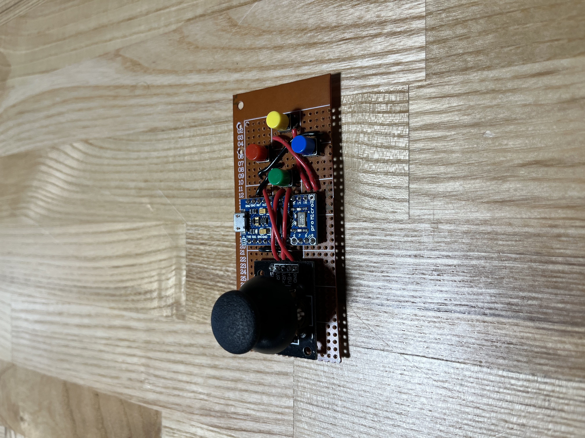
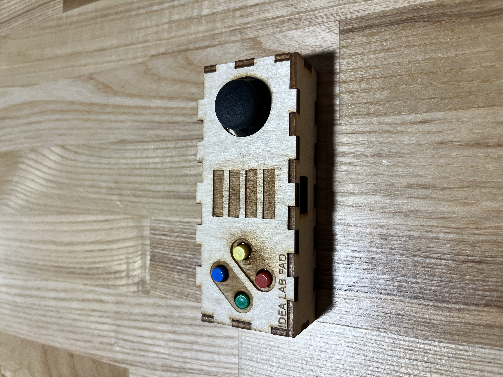

# Arduino-Gamepad
A USB gamepad made from an Arduino Pro Micro that I developed into a soldering workshop in the Fall of 2020 to Fall 2021.

# Table of Contents
1. [Description](#description)
2. [Materials](#materials)
3. [Libraries Needed](#libraries-needed)
4. [Prototypes](#prototypes)
5. [PCB Schematics](#pcb-schematics)
6. [Assembly Steps](#assembly-steps)

# Description
This workshop allows attendees to make their own game controller out of an Arduino, custom PCBs, buttons, and a joystick. It will teach about soldering, specifically through hole soldering. We use custom PCBs to eliminate the need for wires and make it eaiser for first solderers. It will also introduce the participants to Arduino code and libraries, although they will not code, it is important to do a quick overview of the code so that they understand why their game controller works. The goal of this workshop is to introduce attendees to Arduinos, soldering, solder safety, PCBs, and for them to walk away with a cool game controller that they personally made. 

# Materials
1. Arduino Pro Micro
2. Custom PCBs (main PCB and button PCB)
3. 4 Tactile Button Switches
4. USB Cable
5. Joystick
6. Soldering Iron
7. Solder
8. Custom Case

# Libraries Needed
1. [Keyboard by Arduino](https://www.arduino.cc/reference/en/libraries/keyboard/)
2. [Mouse by Arduino](https://www.arduino.cc/reference/en/libraries/mouse/)

# Prototypes

\
This was the first every prototype of the gamepad. It was created from a stripboard, wires, joystick, buttons, and Arduino Pro Micro. The problem with this design was the height of the buttons being way too low, creating difficulties in desinging a case for it, and making it very comfortable to use. 
  

This is the second prototype with the button height raised.

This is the outside of the second protype. Observe that the height of the buttons is now level with the joystick and this was accomplished by using two cut stripboards. The biggest flaw with the design was all the soldering and wiring that needed to be done. This second prototype was run for a class and as a workshop in the Fall of 2020 at Sacred Heart University's IDEA Lab with the majority of the participants not having any experience with soldering. It took students from the class coming back on three sepearte occassions for 2 hour sessions in order for the majority of them to finish. And many students during the workshop were not able to get theirs to even work.

In the end everyone had fun, but it was clear that there was a huge flaw with running this for a class or workshop. The prep was long and tediuous as one had to cut all the wires out and sort them to make sure that the right length wire were being used and trying to monitor multiple students following all the wiring was difficult to manage. However, this is what led us to the final design and the same wiring and schematics was used in the PCB version.

  

# Assembly Steps
1. Place Arduino header pins and arduino on PCB.
2. Flip over PCB so that you can solder the header pins to the PCB board.
3. Solder header pins to Arduino.
9. Solder joystick.
10. Solder female header pin extender.
11. Solder buttons onto Button PCB.
12. Solder header pin, with long side on the bottom to the Button PCB.
13. Put the two PCBs together.
14. Check circuit and upload code to test
15. Create/put in casing
16. Once in case test again to make sure everything is operational
